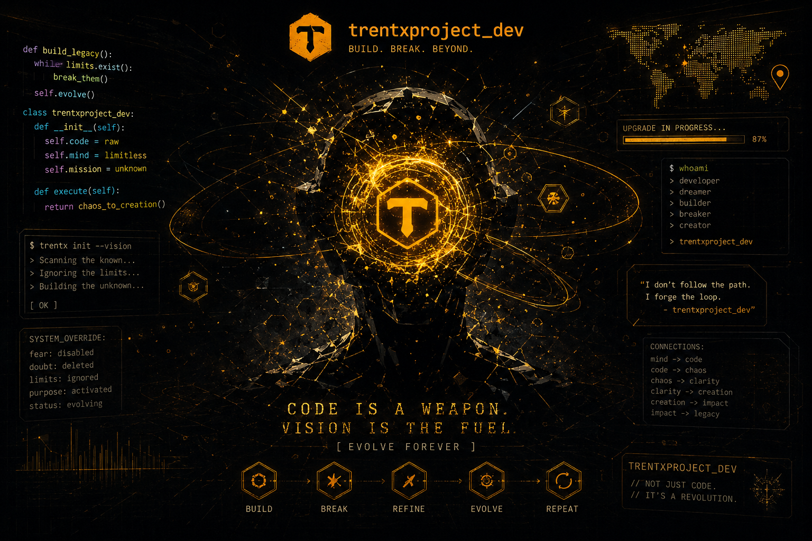

<div align="center"> 

# <span style="color:#FF0000;">TRENTXPROJECT_DEV</span>

### SELF-TAUGHT DEVELOPER | PROGRAMMER | GAME DEVELOPMENT ENTHUSIAST

**LEARN. PRACTICE. BUILD. IMPROVE.**

</div>

---

## ABOUT ME

I'm a self-taught developer who enjoys learning by actually building things.

I explore different programming languages, technologies, systems, and tools while working on projects, experiments, scripts, and game development.

I don't claim to master every technology I use.

I'm learning them.

I'm experimenting with them.

I'm breaking things with them.

And I'm improving one project at a time.

### MY WORKFLOW

```text
IDEA
  |
LEARN
  |
PLAN
  |
BUILD
  |
TEST
  |
BREAK
  |
DEBUG
  |
IMPROVE
  |
REBUILD
  |
EVOLVE
  |
REPEAT
```

---

## WHAT DO I DO?

- Learn programming through tutorials and experimentation
- Build small projects to improve my skills
- Explore game development and game systems
- Create scripts, tools, and experiments
- Experiment with different programming languages
- Break things and debug them
- Improve and optimize existing projects
- Explore web technologies
- Study how systems work
- Turn ideas into working projects

---

## LANGUAGES & TECHNOLOGIES

### Programming Languages

<div align="center">


</div>

### Web Development

<div align="center">


</div>

### Databases & Tools

<div align="center">


</div>

> I'm still learning many of these technologies.
>
> Using a language doesn't mean I've mastered it.

---

## GAME DEVELOPMENT

Game development is one of the areas I enjoy exploring the most.

I'm interested in experimenting with:

```text
Gameplay Systems
Game Mechanics
Modular Systems
User Interfaces
Data Systems
Event Systems
AI / NPC Behavior
Saving Systems
Multiplayer Concepts
Developer Tools
Experimental Mechanics
```

Sometimes an idea works perfectly.

Sometimes everything explodes.

Either way:

**There's something to learn.**

---

## EXPERIMENTATION

One of the questions I like asking is:

> **"What if I tried this?"**

Try something new.

Change the system.

Test an unusual approach.

Build something you've never built before.

Break it.

Find out why it broke.

Then make it better.

```text
QUESTION
   |
EXPERIMENT
   |
RESULT
   |
FAILURE
   |
DEBUG
   |
KNOWLEDGE
   |
IMPROVEMENT
```

---

## MY PROJECTS

I use GitHub as a place to:

- Build
- Experiment
- Practice
- Document ideas
- Test systems
- Share projects
- Learn from mistakes

Not every project will be perfect.

Some projects may be:

```text
FINISHED
EXPERIMENTAL
LEARNING PROJECTS
PROTOTYPES
WORK IN PROGRESS
COMPLETELY BROKEN
```

And that's okay.

Every project is another opportunity to learn.

---

## FROM IDEA TO REALITY

```text
IDEA
 |
PLAN
 |
CODE
 |
SYSTEM
 |
PROJECT
 |
TEST
 |
BREAK
 |
DEBUG
 |
IMPROVE
 |
REBUILD
 |
EVOLVE
```

An idea is only a possibility.

Code gives it structure.

Experimentation gives it direction.

Persistence gives it a chance to become something real.

---

## CURRENT MINDSET

```text
Don't wait until you know everything.

Start.

Build something small.

Break it.

Figure out why.

Fix it.

Learn from it.

Build something better.

Repeat.
```

---

## LEARNING

I'm constantly exploring new technologies whenever I have the opportunity.

My goal isn't to know everything.

My goal is to keep learning.

```text
LEARN
  |
PRACTICE
  |
BUILD
  |
FAIL
  |
UNDERSTAND
  |
IMPROVE
  |
REPEAT
```

---

## GOT AN IDEA?

Have an idea for a:

**Game | Script | Tool | System | Website | Experiment**

Don't just leave it as an idea.

```text
THINK
 |
CREATE
 |
EXPERIMENT
 |
BREAK
 |
DEBUG
 |
LEARN
 |
IMPROVE
 |
BUILD AGAIN
 |
GO BEYOND
```

---

## GITHUB STATS

<div align="center">


</div>

---

## CONTRIBUTION GRAPH

<div align="center">


</div>

---

<div align="center">

# BUILD. BREAK. BEYOND.

### Every project begins with an idea.

### Every idea begins with imagination.

### Every creation begins with the decision to start.

```text
CODE IS A WEAPON.
VISION IS THE FUEL.
[ EVOLVE FOREVER ]
```

</div>
